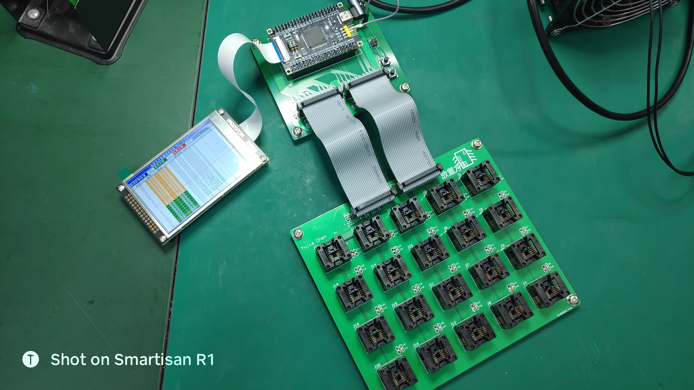
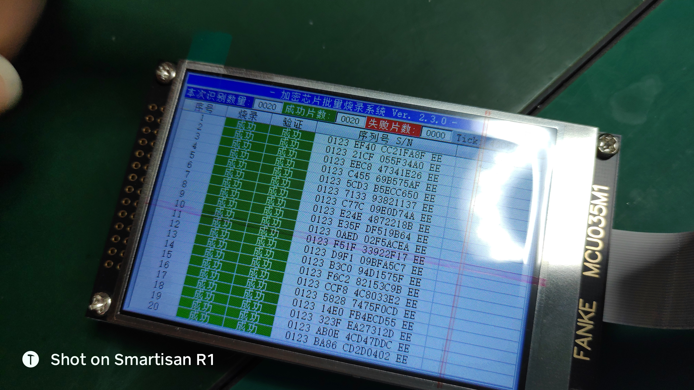

# :beers: Microchip_CryptoAuthLib_STM32 

[](https://app.fossa.com/projects/git%2Bgithub.com%2FSummerFalls%2FMicrochip_CryptoAuthLib_STM32?ref=badge_small)

<a href="https://github.com/SummerFalls/Microchip_CryptoAuthLib_STM32/releases"></a>
<a href="https://github.com/SummerFalls/Microchip_CryptoAuthLib_STM32/graphs/contributors"></a>
<a href="https://github.com/SummerFalls/Microchip_CryptoAuthLib_STM32/blob/master/LICENSE"></a>
<a title="Hits" target="_blank" href="https://github.com/SummerFalls/Microchip_CryptoAuthLib_STM32"></a>

```c
      ____________________________
     /                           /\
    /                          _/ /\
   /   Encryption IC Burner   / \/
  /                           /\
 /___________________________/ /
 \___________________________\/
  \ \ \ \ \ \ \ \ \ \ \ \ \ \ \
```

## :wink: 简介

Microchip 加密芯片 CryptoAuthLib 库在 STM32 上的移植以及对称 IP 保护使用示例

## :dark_sunglasses: 硬件 & 软件 需求

本工程可直接编译并烧录运行于 `反客STM32F103VET6最小系统开发板` 上，当然也可根据你自己的芯片型号进行移植，通过配合使用STM32CubeMX，移植工作将非常方便快捷。

**注意:**

1. 在 Keil 中编译时，需要使能目标设置中的 GNU extensions
2. 若自己移植到其它 MCU，使用 GCC 编译器的 IDE 也许会更好，例如 TrueStudio/STM32CubeIDE

### 硬件需求

- STM32F103VET6
- 杜邦线若干
- SOIC8 编程烧录座

### 软件需求

- Keil uVision5.27
- STM32CubeMX 5.3.0 及以上
- [CryptoAuthLib](https://github.com/MicrochipTech/cryptoauthlib)
- 串口调试工具 putty/SSCOM/超级终端...

## :checkered_flag: 参考程序

- [cryptoauth_usecase_ipprotection_symmetric](https://github.com/MicrochipTech/cryptoauth_usecase_ipprotection_symmetric)

## :star: License

MIT License

Copyright (c) 2019 SummerFalls

Permission is hereby granted, free of charge, to any person obtaining a copy
of this software and associated documentation files (the "Software"), to deal
in the Software without restriction, including without limitation the rights
to use, copy, modify, merge, publish, distribute, sublicense, and/or sell
copies of the Software, and to permit persons to whom the Software is
furnished to do so, subject to the following conditions:

The above copyright notice and this permission notice shall be included in all
copies or substantial portions of the Software.

THE SOFTWARE IS PROVIDED "AS IS", WITHOUT WARRANTY OF ANY KIND, EXPRESS OR
IMPLIED, INCLUDING BUT NOT LIMITED TO THE WARRANTIES OF MERCHANTABILITY,
FITNESS FOR A PARTICULAR PURPOSE AND NONINFRINGEMENT. IN NO EVENT SHALL THE
AUTHORS OR COPYRIGHT HOLDERS BE LIABLE FOR ANY CLAIM, DAMAGES OR OTHER
LIABILITY, WHETHER IN AN ACTION OF CONTRACT, TORT OR OTHERWISE, ARISING FROM,
OUT OF OR IN CONNECTION WITH THE SOFTWARE OR THE USE OR OTHER DEALINGS IN THE
SOFTWARE.

## :bulb: 扩展项目示例（STemWin & FreeRTOS）

:speech_balloon: 以下图片中运行的程序是本仓库工程的带 GUI 版本，在本仓库程序的基础上扩展而来



